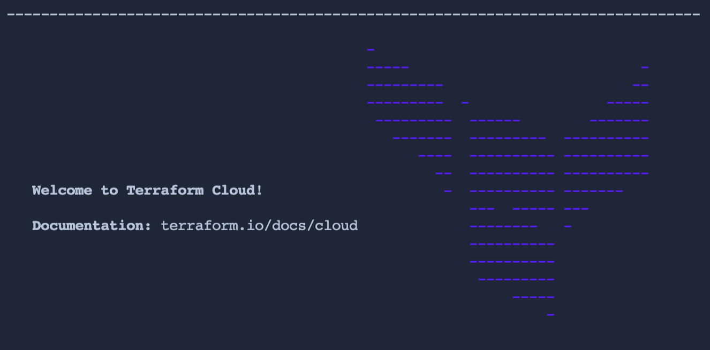

<style>
  m {
    display: inline-flex;
    color: white;
    background-color: #584ED5;
    align-items: center;
    justify-content: center;
    font-size: 14px;
    padding: 10px;
    height: 24px;
    border-radius: 5px;
    border: 1px solid rgba(151,159,175,1);
  }

  x {
    display: inline-flex;
    border-radius: 5px;
    border: 1px solid rgba(151,159,175,1);
    /* background-color: rgba(151,159,175,1); */
    /* background-color: rgba(30,38,55,1); */
    color: rgba(151,159,175,1);
    padding: 2px 10px 2px 10px;
    font-size: 14px;
    letter-spacing: 1.2px;
    align-items: center;
    justify-content: center;
    height: 24px;
  }

o {
  color:#BA55D3;
  padding: 0 5px;
  font-weight: bold;
  text-decoration: none;
}

o:hover {
  text-decoration: underline;
}

lb {
  display: flex;
  color: #222;
  background-color: lightblue;
  padding: 10px;
  margin: 10px 10px 10px 1px;
  border-radius: 3px;
  box-shadow: 2px 2px 10px;
}

</style>

This Instruqt track will use your Terraform Cloud user API key to setup a scenario environment within your training account and/or verify the challenge steps have been completed successfully.

Step 1: Create a TFC Account
===

> [!IMPORTANT]
> If you already have a TFC account for use with Instruqt, skip this step and go to Step 2.

- Sign up for a free Terraform Cloud account at https://app.terraform.io/signup/account.

- Once the account has been created, you will need to confirm your address using the email you will receive from HashiCorp.

Step 2: Terraform Cloud Token
===

- Use this <o>[link](https://app.terraform.io/app/settings/tokens?source=terraform-login)</o> to visit the <x>User Settings</x>-<x>Tokens</x> page in your Terraform Cloud account.

- Use the <m>Create API token</m> button to generate a new **personal user token** to use in this workshop.

- <lb>Make sure to save your Terraform Cloud token. It will not be displayed again.</lb>

Step 3: Login to the Terraform Cloud CLI
===

- Move to the [button label="Terminal"](tab-0) tab and store your Terraform Cloud Token locally with the following command:

```bash
terraform login


```

You should see the following output after logging into Terraform Cloud.


Click the [button label="Check" variant="success"](https://) button below to continue.